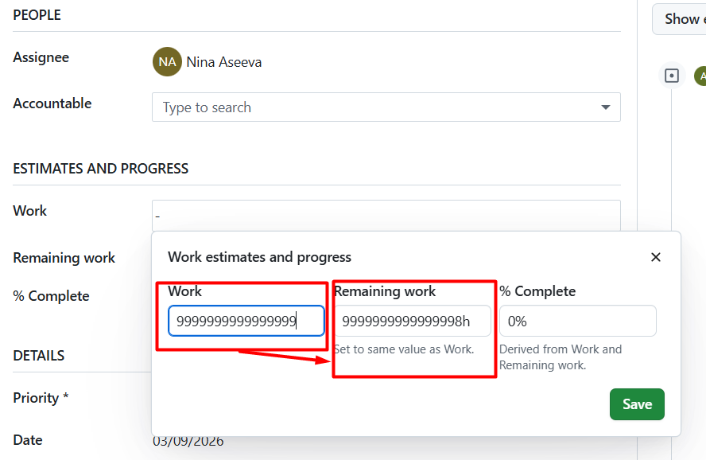
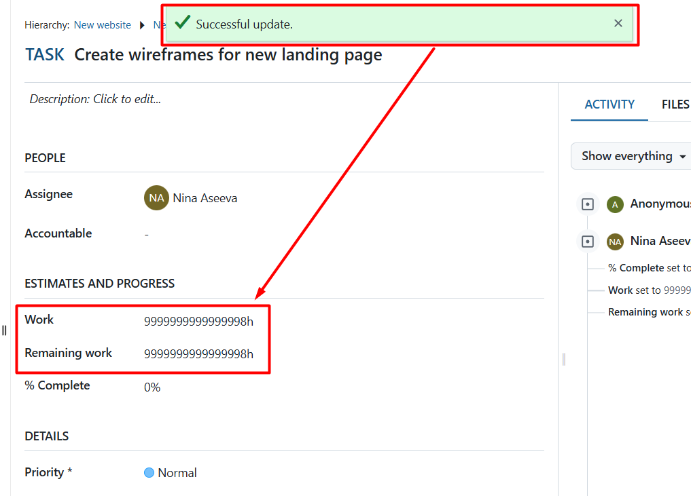
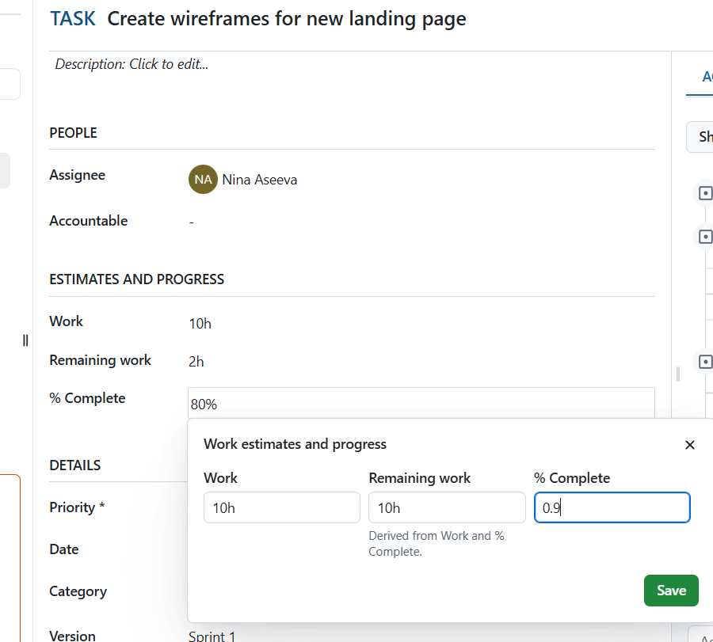
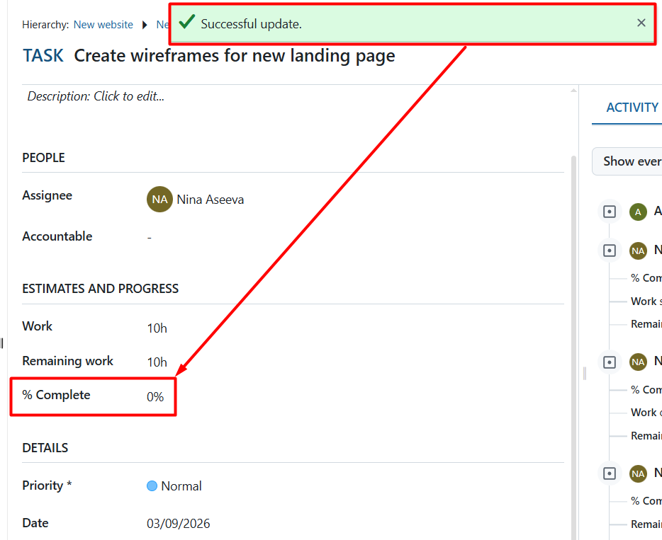

# OpenProject-Manual-Testing
QA : Fehler, Checklisten, Testfälle

# Fehlerbericht OP-001: Integer Overflow im Feld "Work"

| Kategorie | Details |
| :--- | :--- |
| Name | Integer Overflow im Feld "Work", "Remaining Work" |
| Priorität | Hoch |
| GIVEN | Ein Arbeitspaket ist im Bearbeitungsmodus geöffnet; das Feld "Arbeit" ist leer. |
| WHEN | 1.Der Benutzer gibt den Wert 9999999999999999 (16 Neunen) in das Feld "Work" ein. 2. Der Benurzer beobachtet die automatische Berechnung des Feldes "Remaining Work".3 Der Benutzer klickt auf das Häkchen "Save"|
| EXPECTED RESULT | Das System validiert die Eingabe korrekt (zeigt Fehler an oder begrenzt den Wert). 2. Nach dem Speichern muss der ursprüngliche Wert 9999999999999999 im Feld "Work" unverändert bleiben. |
| ACTUAL RESULT | Das Feld "Remaining Work" zeigt den gegründeten Wert 9999999999999998 an (15 Neunen und eine Acht am Ende). Die Zahl wird falsch gerundet/berechnet. 2. Nach dem Speichern wird auch der Wert "Work" überschrieben und auf 9999999999999998 (15 Neunen und eine Acht am Ende) geändert. |
| Environment | Browser Brave 1.85.118 (Chromium 143.0.7499.169), OS Windows 10,  Open Project Community Edition   |

# Screenshots zur Fehlerkonstruktion

## 1.Zeigt den automatischen Rundungsfehler direkt nach der Dateneingabe in Interface

## 2.Belegt die dauerhafte Datenkorruption nach dem Speichervorgang trotz Erfolgsmeldung

# Fehlerbericht OP-002: Inkonsistente Rundungslogik und Präzisionsverlust
| Kategorie | Details |
| :--- | :--- |
| Name | System unterstützt keine Dezimalwerte im Feld "Complete" in % |
| Priorität | Mittel |
| GIVEN |  Ein Arbeitspaket ist im Bearbeitungsmodus geöffnet; das Feld "Complete" ist leer |
| WHEN | 1. Der Benutzer gibt gibt im Feld "% Complete" den Dezimalwert 0.9 ein. 2. Der Benutzer klickt auf die Schaltfläche "Save" |
| EXPECTED RESULT | Das System akzeptiert und speichert den Dezimalwert ODER Das System rundet mathematisch korrekt auf die nächste Ganzzahl ODER Das System gibt eine Fehlmeldung aus, dass nur Ganzzahlen zulässig sind |
| ACTUAL RESULT | Das System speichert den Wert als 0. Das Feld "Remaining work" bleibt unverändert. Es findet ein "UI- Flackern" statt : Kurzzeitig wird 1 angezeigt, nach dem Neuladen der Daten vom Server steht dort jedoch wieder 0. |

# Screenshots zur Fehlerkonstruktion

## 1. Zeigt die Dateneingabe in Interface

## 2. Zeigt die Datenverlust nach Speichern

# Fehlerbericht OP-003: Benachrichtigungs - Spam (Flood) 

| Kategorie | Details |
| :--- | :--- |
| Name UI/UX - Fehler: Übermäßige Anzahl an Benachrichtungen ohne Gruppierung|
| Priorität | Mittel |
| GIVEN | Der Benutzer versucht, mehrere Dateien gleichzeitig hochzuladen, die vom System abgelehnt werden |
| WHEN | Das System generiert für jede einzelne Datei eine separate Toast - Benachrichtigung |
| EXPECTED RESULT |Das System sollte die Fehler sammeln und in einer in einer zusammengefassten Meldung anzeigen |
| ACTUAL RESULT | Der Bildschirm wird mit 14 identischen Meldungen überflutet, die den Arbetsbereich verdecken und einzeln geschlossen werden müssen |

# Screenshots zur Fehlerkonstruktion

## 1. Zeigt Spam in Interface

! [BugScreenshot_5](Bug003_Notification_Flood.png)

